# CLI Init Flow

This document is a **panoramic design view** of the `dot init` interactive survey — the questions, the branches, and what each answer maps to. The code doesn't exist yet. This is the spec we're building toward.

The survey runs in two phases:

**Phase 1 — base questions** (always the same, hardcoded in `cmd/dot/cmd_init.go`): project name, type, and language. Language is the branch point.

**Phase 2 — registry-driven questions**: once the language is known, the matching Registry is looked up. The Registry owns a question tree — its questions, its module options, its architecture choices. Phase 2 runs that tree. Different registries ask different questions in different orders; they reuse shared question templates where the question text and options are identical across languages.

The `huh` form for Phase 2 is built dynamically from the selected registry's question tree, then rendered as a second `form.Run()`. This is why adding a new language (e.g. Rust) does not require modifying `cmd_init.go` — it only requires registering a RustRegistry.

See [registry-design.md](registry-design.md) for the full Registry design.

---

## Flow diagram

```mermaid
flowchart TD
    START([dot init]) --> Q_NAME[Project name]
    Q_NAME --> Q_TYPE[Project type\nfullstack / backend / frontend]
    Q_TYPE --> Q_MONOREPO{Monorepo?}

    Q_MONOREPO -->|Yes| Q_APPS_COUNT[How many apps?]
    Q_MONOREPO -->|No| APP_LOOP_SINGLE[Single app]

    Q_APPS_COUNT --> APP_LOOP[For each app: app config loop]
    APP_LOOP_SINGLE --> APP_LOOP

    %% ─── App config loop ───────────────────────────────────────────────
    subgraph APP_CONFIG [App config — repeated per app]
        direction TB
        Q_APP_NAME[App name]
        Q_APP_KIND[App type\nfrontend / backend]

        Q_APP_NAME --> Q_APP_KIND
        Q_APP_KIND -->|frontend| FRONTEND_FLOW[Frontend flow]
        Q_APP_KIND -->|backend| BACKEND_FLOW[Backend flow]

        subgraph FRONTEND_FLOW [Frontend]
            Q_FE_FRAMEWORK[Framework\nReact / Next.js / Vue.js]
            Q_FE_ARCH[Frontend architecture\nFeature-sliced / Atomic Design / Container-Presentational]
            Q_FE_FRAMEWORK --> Q_FE_ARCH
        end

        subgraph BACKEND_FLOW [Backend]
            Q_BE_ARCH_TYPE[Architecture type\nmicroservices / monolith]

            Q_BE_ARCH_TYPE -->|monolith| MONOLITH_FLOW
            Q_BE_ARCH_TYPE -->|microservices| MICROSERVICES_FLOW

            subgraph MONOLITH_FLOW [Monolith]
                Q_MONO_LANG[Language\nGo / TypeScript / Python]
                Q_MONO_FRAMEWORK[Framework\nbased on language]
                Q_MONO_ARCH[Architecture pattern\nMVC / Clean Architecture / Hexagonal]
                Q_MONO_LANG --> Q_MONO_FRAMEWORK --> Q_MONO_ARCH
                Q_MONO_ARCH --> Q_LINTER
            end

            subgraph MICROSERVICES_FLOW [Microservices]
                Q_MS_HOST[Hosting strategy\nglobal / per service]
                Q_MS_EVENT[Event manager\nNone / NATS / gRPC]
                Q_MS_GATEWAY[Gateway type\nlocal / cloud]
                Q_MS_SVC_COUNT[Number of services]

                Q_MS_HOST --> Q_MS_EVENT --> Q_MS_GATEWAY --> Q_MS_SVC_COUNT

                Q_MS_SVC_COUNT --> SVC_LOOP[For each service: service config loop]

                subgraph SVC_CONFIG [Service config — repeated per service]
                    direction TB
                    Q_SVC_NAME[Service name]
                    Q_SVC_LANG[Language\nGo / TypeScript / Python]
                    Q_SVC_FRAMEWORK[Framework\nbased on language]
                    Q_SVC_ARCH[Architecture pattern\nMVC / Clean Architecture / Hexagonal]
                    Q_SVC_NAME --> Q_SVC_LANG --> Q_SVC_FRAMEWORK --> Q_SVC_ARCH
                    Q_SVC_ARCH --> Q_LINTER
                end
            end
        end

        %% ─── Service / app detail (shared by monolith + each microservice) ─
        Q_LINTER[Linter\ngolangci-lint / eslint / ruff / none]
        Q_FORMATTER[Formatter\ngofmt / prettier / black / none]
        Q_DB[Databases\nPostgres / MySQL / MongoDB / Redis / none]
        Q_DB_CONFIG[DB schema\ntable names, fields, relationships]
        Q_ROUTES_REVIEW[Review generated routes\nauto-proposed from schema — remove or edit]
        Q_ROUTES_CUSTOM[Add custom routes?\noptional]
        Q_USECASES[Use cases\nCRUD generator or custom prompt]

        Q_LINTER --> Q_FORMATTER --> Q_DB --> Q_DB_CONFIG
        Q_DB_CONFIG --> Q_ROUTES_REVIEW
        Q_ROUTES_REVIEW --> Q_ROUTES_CUSTOM --> Q_USECASES

        Q_USECASES -->|CRUD| CRUD_GEN[Generate CRUD scaffold\nfor each resource]
        Q_USECASES -->|Custom prompt| CUSTOM_PROMPT[Write prompt to .dot/prompts.md]
    end

    APP_LOOP --> APP_CONFIG

    %% ─── Global config ─────────────────────────────────────────────────
    APP_CONFIG --> GLOBAL_CONFIG

    subgraph GLOBAL_CONFIG [Global config — once per project]
        direction TB
        Q_HOST[Deployment target\nGCP / AWS / Docker / none]
        Q_TOOLS[Add-on tools\nGrafana / Sentry / PostHog / TanStack / shadcn / GraphQL / ...]
        Q_CI[CI provider\nGitHub Actions / GitLab CI / none]
        Q_HOST --> Q_TOOLS --> Q_CI
    end

    GLOBAL_CONFIG --> CONFIRM[Review summary\nConfirm or restart]

    CONFIRM -->|Confirmed| GENERATE[Generate project\npipeline.Run]
    CONFIRM -->|Restart| START

    GENERATE --> PROMPTS_PENDING{Custom prompts\npending?}
    PROMPTS_PENDING -->|Yes| PROMPT_NOTICE[Display: run prompts in .dot/prompts.md\nor dot run-prompts if API key configured]
    PROMPTS_PENDING -->|No| DONE
    PROMPT_NOTICE --> DONE([Project ready])
```



---

## Monorepo with mixed architectures

A monorepo can freely mix app types in the "for each app" loop. A common fullstack setup:

```
Monorepo
├── App 1: frontend (React + Feature-sliced Design)
└── App 2: backend → microservices
          ├── Gateway (nginx / Traefik)
          ├── Service 1: user-api (Go, Clean Architecture, Postgres)
          └── Service 2: billing-api (TypeScript, Express, Postgres)
```

The loop runs once for each app. The frontend app goes through the frontend sub-flow and exits at `Q_FE_ARCH`. The backend app goes through the microservices sub-flow and spawns its own per-service config loop.

The gateway, event manager, and hosting strategy questions belong to the backend app's scope, not the project root. Each backend app in the monorepo is independently configured.

This means a monorepo can have:
- Multiple frontends (each with their own framework and architecture)
- A monolithic backend and a microservices backend side by side
- Services in different languages within the same microservices app

---

## Schema-first route generation

When a user defines their DB schema (tables, fields, relationships), dot proposes routes automatically:

```
You defined: User (id, email, name), Order (id, user_id, total)

Generated routes:
  GET    /users              ✓ keep
  POST   /users              ✓ keep
  GET    /users/:id          ✓ keep
  PUT    /users/:id          ✓ keep
  DELETE /users/:id          remove
  GET    /orders             ✓ keep
  POST   /orders             ✓ keep
  GET    /orders/:id         ✓ keep
  PUT    /orders/:id         ✓ keep
  DELETE /orders/:id         remove
  GET    /users/:id/orders   ✓ keep   ← inferred from foreign key

  + Add custom route
```

The user removes routes they don't want and can add routes that aren't CRUD (e.g. `POST /orders/:id/confirm`).

After this step, the use case question is context-aware:
- If the user only kept standard CRUD routes → CRUD generator is the obvious choice
- If the user added custom routes → custom prompt is recommended

---

## Use cases mode: CRUD vs custom prompt

### Option 1 — CRUD generator

Generates the full CRUD scaffold for the confirmed routes:
- Model / entity
- Route handlers
- Use case / service layer stubs
- DB migration stub

Fully automated. No post-flow action required.

### Option 2 — Custom prompt

The user describes what to build beyond standard CRUD. The prompt is structured and written to `.dot/prompts.md`:

```
## Service: booking-api

You are scaffolding a REST API service called booking-api (Go, Clean Architecture, Postgres).

Goal: a booking system with availability slots and reservations.
Schema: Slot (id, date, capacity, booked), Reservation (id, slot_id, user_id)

Generate:
- Domain entities and interfaces
- Use case layer (CheckAvailability, CreateReservation, CancelReservation)
- REST handlers for: POST /reservations, DELETE /reservations/:id, GET /slots/available
- Postgres migrations

Constraints: follow the existing project structure in this repo.
```

### Running the prompts (v0.3)

In v0.3, `dot run-prompts` will be available. Two modes:

**Manual (always available):**
```
Custom prompts are ready:
  cat .dot/prompts.md        # read the prompts
  dot run-prompts --dry-run  # see what would be generated
  dot run-prompts            # execute against configured AI provider
```

**Automatic (when API key is configured):**
```bash
dot config set ai.provider openai
dot config set ai.key sk-...
```

After base project generation, if an API key is configured, dot offers:
```
Custom prompts pending. Run them now? (uses OpenAI, ~3 API calls)
  > Yes, run now
  > No, I'll run them manually later
```

The prompts file is committed as part of the scaffold — it's part of the project state, not a temp file. Running it later (after the user has customized the generated code) is valid.

---

## Question reference

> **Note:** Spec field names below (`AppSpec`, `ServiceSpec`, etc.) are planned names for the v0.2 multi-app data model. They don't exist in `internal/spec/spec.go` yet — that's blocked on open decision #7 (multi-app engine iteration). Treat them as the intended shape, not the current implementation.

### Top-level

| Question | Values | Spec field |
|----------|--------|-----------|
| Project name | string | `Spec.Project.Name` |
| Project type | `fullstack`, `backend`, `frontend` | `Spec.Project.Type` |
| Monorepo? | `true / false` | `Spec.Project.Monorepo` |
| Number of apps | integer | drives the app config loop |

> **Project type reconciliation:** The existing `spec.go` has fine-grained types (`api`, `cli`, `library`, `frontend`, `worker`). The new TUI uses higher-level labels: `backend` maps to `api` or `worker` depending on further questions; `frontend` maps to `frontend`; `fullstack` is a shorthand for monorepo = true with at least one frontend and one backend app. The existing `monorepo` project type constant is superseded by the `Monorepo?` flag + actual app types — a monorepo is no longer its own project type, it's a structural flag.

### Per app

| Question | Values | Spec field |
|----------|--------|-----------|
| App name | string | `AppSpec.Name` |
| App type | `frontend`, `backend` | `AppSpec.Kind` |
| Architecture type | `microservices`, `monolith` | `AppSpec.ArchType` |

### Microservices only (per backend app)

| Question | Values | Spec field |
|----------|--------|-----------|
| Hosting strategy | `global`, `per-service` | `AppSpec.Config.HostingStrategy` |
| Event manager | `none`, `nats`, `grpc` | `AppSpec.Config.EventManager` |
| Gateway type | `local`, `cloud` | `AppSpec.Config.GatewayType` |
| Number of services | integer | drives the service config loop |

> **gRPC deduplication:** If `grpc` is selected as event manager, the gRPC module is automatically included for all services — it won't be offered again in the global add-on tools step. GraphQL remains a separate add-on tool (it's a query layer, not a transport).

### Per service / monolith app

| Question | Values | Spec field |
|----------|--------|-----------|
| Service name | string | `ServiceSpec.Name` |
| Language | `go`, `typescript`, `python` | `ServiceSpec.Language` |
| Framework | depends on language | `ServiceSpec.Framework` |
| Architecture pattern | `mvc`, `clean`, `hexagonal` | `ServiceSpec.Architecture` |
| Frontend architecture | `feature-sliced`, `atomic`, `container-presentational` | `ServiceSpec.FrontendArchitecture` |
| Linter | `golangci-lint`, `eslint`, `ruff`, `none` | `ServiceSpec.Config.Linter` |
| Formatter | `gofmt`, `prettier`, `black`, `none` | `ServiceSpec.Config.Formatter` |
| Databases | `postgres`, `mysql`, `mongodb`, `redis`, `none` | `ServiceSpec.Modules[].Name` |
| DB schema | table names, fields, relationships | passed to DB generator |
| Routes (reviewed) | confirmed route list | `ServiceSpec.Routes` |
| Use cases mode | `crud`, `custom` | drives generation strategy |

### Global

| Question | Values | Spec field |
|----------|--------|-----------|
| Deployment target | `gcp`, `aws`, `docker`, `none` | `Spec.Config.DeploymentTarget` |
| Add-on tools | multi-select (gRPC auto-excluded if already chosen as event manager) | `Spec.Modules[].Name` |
| CI provider | `github-actions`, `gitlab-ci`, `none` | `Spec.Config.CI` |

---

## Conditional question logic

| Question | Condition |
|----------|-----------|
| App name | only in monorepo (single-app projects skip this) |
| Number of apps | only when monorepo = true |
| Architecture type (micro/monolith) | only for backend apps |
| Hosting strategy | only for microservices backend apps |
| Event manager | only for microservices backend apps |
| Gateway type | only for microservices backend apps |
| Number of services | only for microservices backend apps |
| Service name | repeated per service (microservices only) |
| Frontend architecture | only when app kind = frontend |
| Architecture pattern (MVC/Clean/Hex) | only when app kind = backend |
| DB schema | only when at least one database is selected |
| Route review | only for REST API generators |
| Use cases mode | only for REST API generators |

---

## Linter / formatter per service — shared default

In a microservices project with multiple services in the same language, the linter/formatter question is asked once per service. To avoid repetition, the TUI should offer:

```
Linter for user-api: golangci-lint
Apply same settings to all Go services? > Yes / No
```

This collapses N identical questions into one.

---

## Implementation notes

- Survey: `cmd/dot/cmd_init.go`, `huh.NewForm()`, one `huh.Group` per question cluster
- Conditional groups: `(*huh.Group).WithHideFunc(func() bool)` — not `WithCondition` (doesn't exist)
- Multi-app Spec: the survey returns a `[]AppSpec` for monorepo/microservices projects, one entry per app. Single-app projects return a single `AppSpec`. This requires resolving open decision #7 first — the multi-app engine iteration
- Schema-first routes: dot generates a candidate route list from the schema server-side (no AI call needed — pure derivation from table names + foreign keys). The TUI presents this list as a checkbox multi-select
- Custom prompts: written to `.dot/prompts.md` after `pipeline.Run()`, before the final success message. Committed as part of the scaffold
- `dot run-prompts` (v0.3): reads `.dot/prompts.md`, calls the configured AI provider. Provider + key stored in `~/.dot/config.toml` (user-level, not committed). Planned alongside `dot add module` in v0.3
- "Restart" on confirm: the back path re-runs `surveySpec()` from scratch. State is not preserved — the user re-enters everything. Implementing per-step backtracking in `huh` is significantly more complex and is deferred
