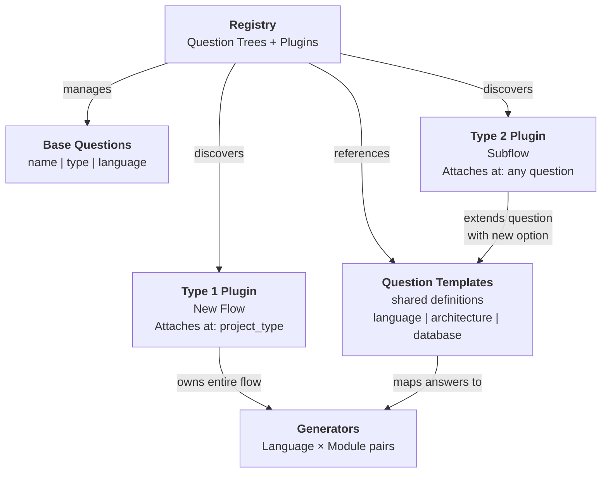
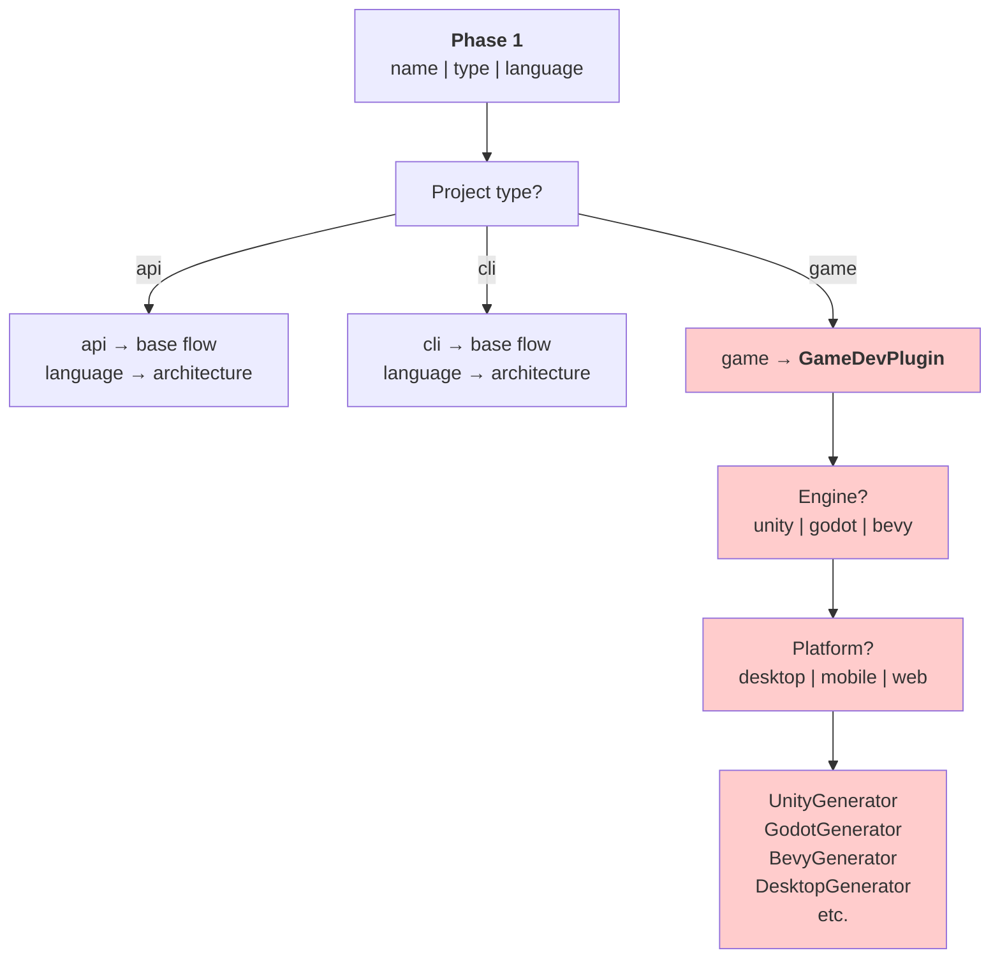
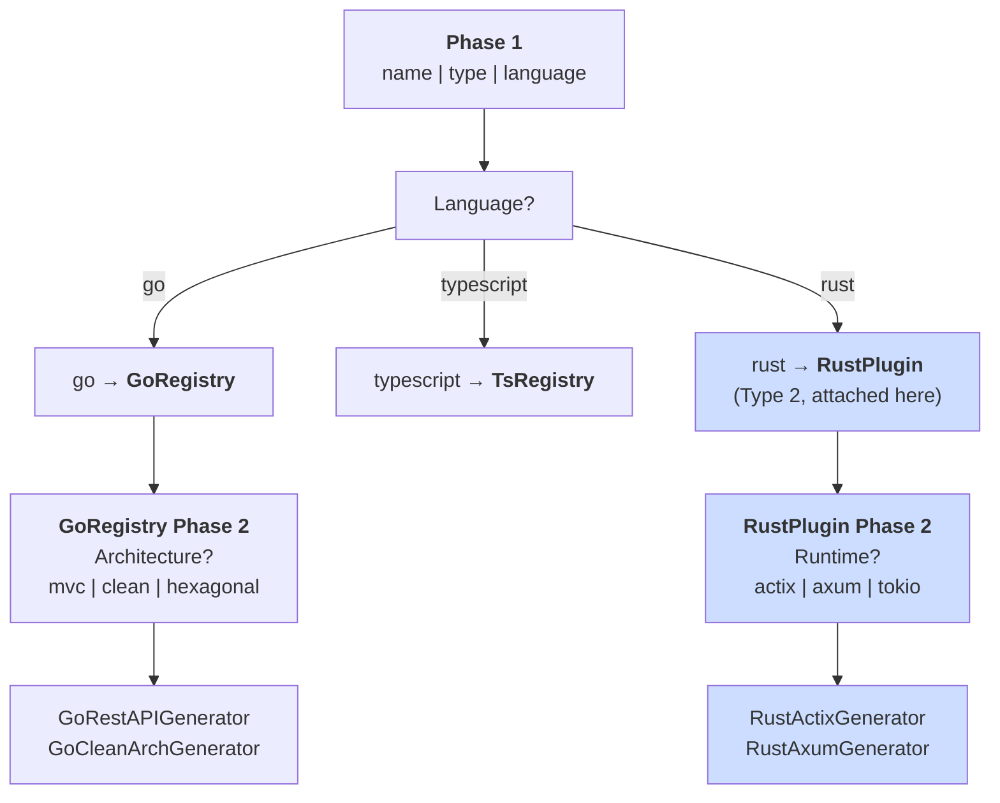
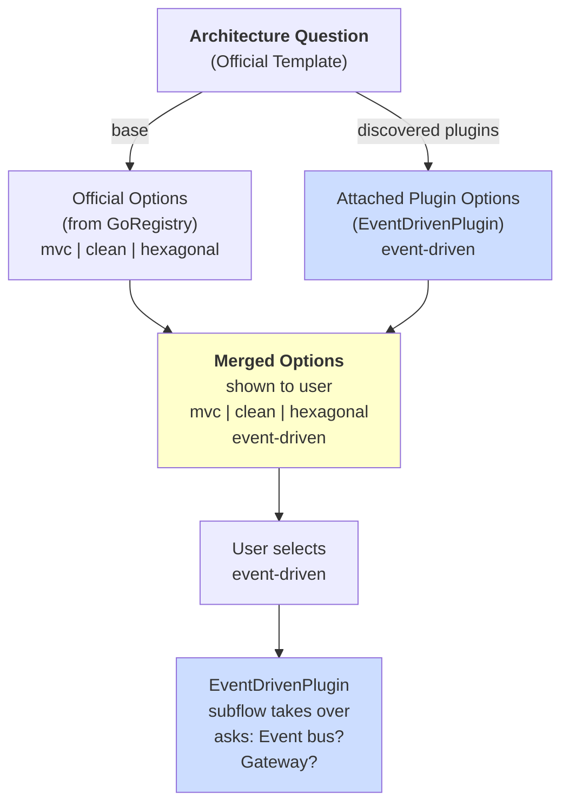
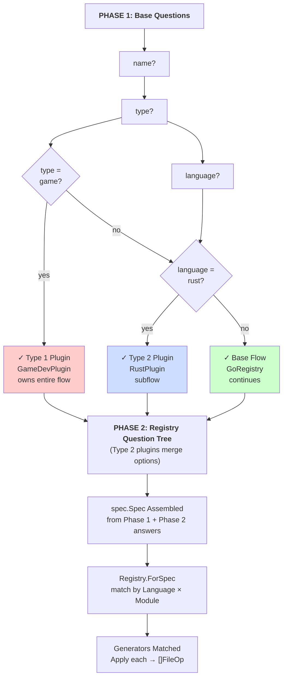
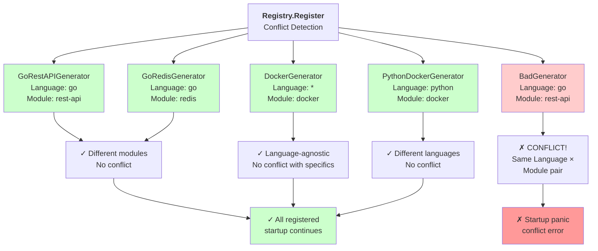
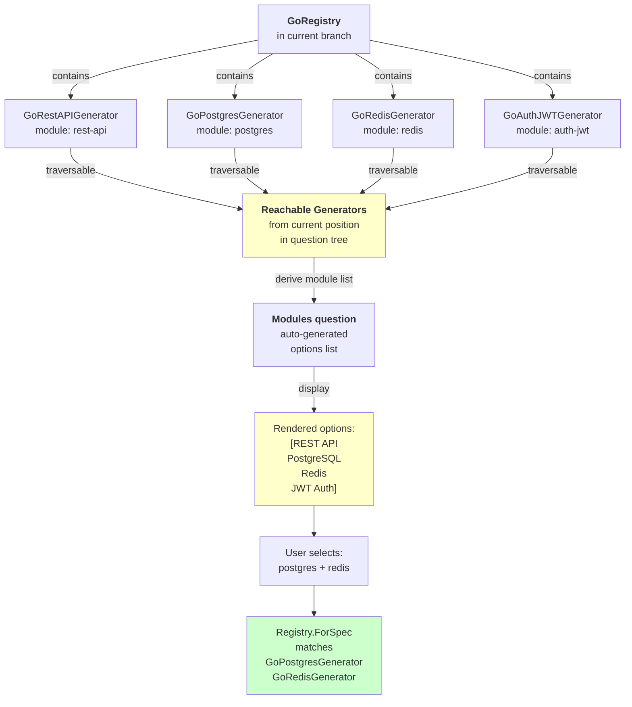
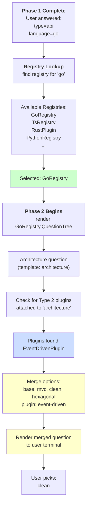
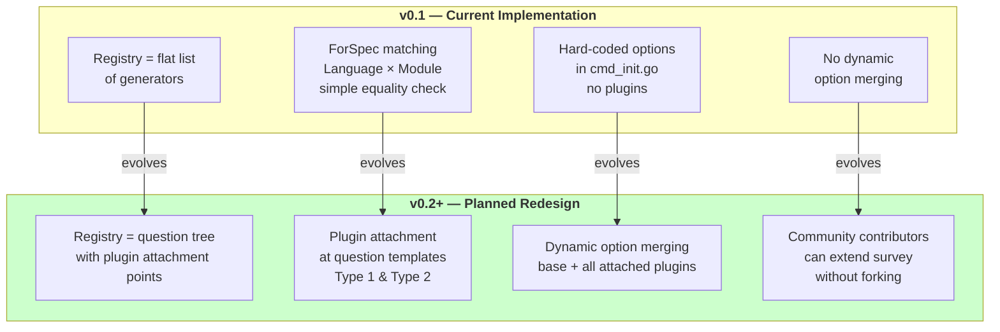
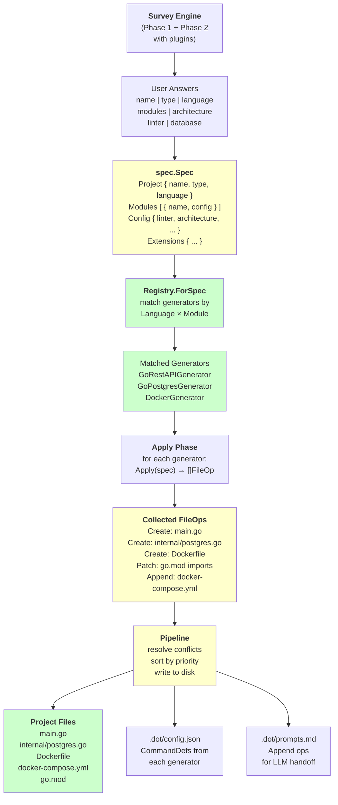

# Registry Architecture — Mermaid Diagrams

Here are several mermaid charts visualizing the registry architecture from different angles.

---

## 1. Plugin Attachment System Overview

---

## 2. Type 1 Plugin Example — Game Development

---

## 3. Type 2 Plugin Example — Multi-Language Support

---

## 4. Question Tree with Plugin Option Merging

---

## 5. Full Two-Phase Survey with Plugin Decision Tree

---

## 6. Generator Registration — Conflict Detection Matrix

---

## 7. Module List Derivation — Auto-Generated from Reachable Generators

---

## 8. Survey Engine at Runtime — Registry Resolution

---

## 9. Architecture Evolution: Current (v0.1) vs Planned (v0.2+)

---

## 10. Complete System Diagram — init → spec.Spec → Generators → FileOps

---

## Key Concepts Summary Table

| Concept | Definition | Example |
|---------|-----------|---------|
| **Question Template** | Reusable survey question definition with ID and base options | `template:"architecture"` with options `[mvc, clean, hexagonal]` |
| **Type 1 Plugin** | Entire new flow branch attached at `project_type` | `GameDevPlugin` replaces language/architecture flow |
| **Type 2 Plugin** | Extension of existing question, adds new options | `RustPlugin` adds `rust` option to `language` question |
| **Attachment Point** | Question template ID where a plugin adds options | `"language"`, `"architecture"`, `"database"` |
| **Module Derivation** | Auto-generate module list from reachable generators | Show only modules this registry can handle |
| **Conflict Matrix** | Rules for which generators can coexist | Same `(Language, Module)` pair = registration error |
| **Plugin Discovery** | At runtime, survey engine finds all plugins for a question | Merge base + plugin options before displaying |
| **Spec Assembly** | Build `spec.Spec` from Phase 1 + Phase 2 answers | Each official template maps to typed `spec.CoreConfig` field |
| **Registry.ForSpec** | Match generators to a Spec by Language × Module | Called after Spec assembly to activate generators |
