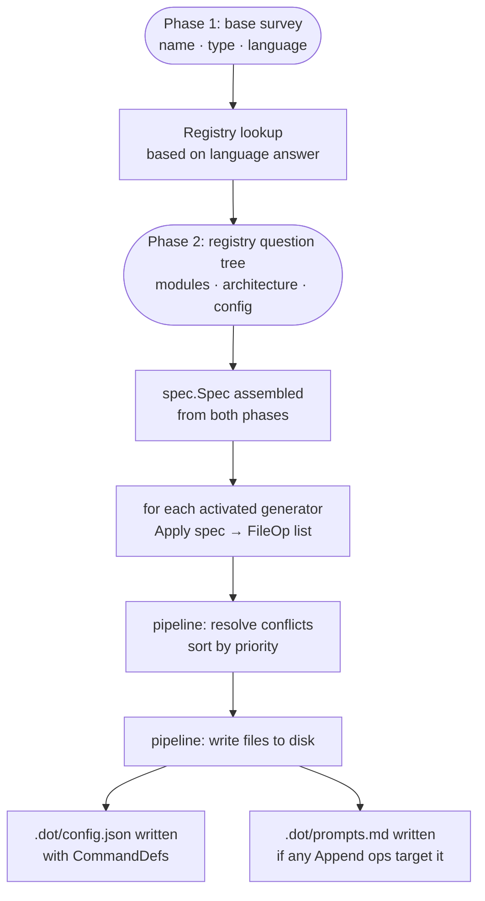
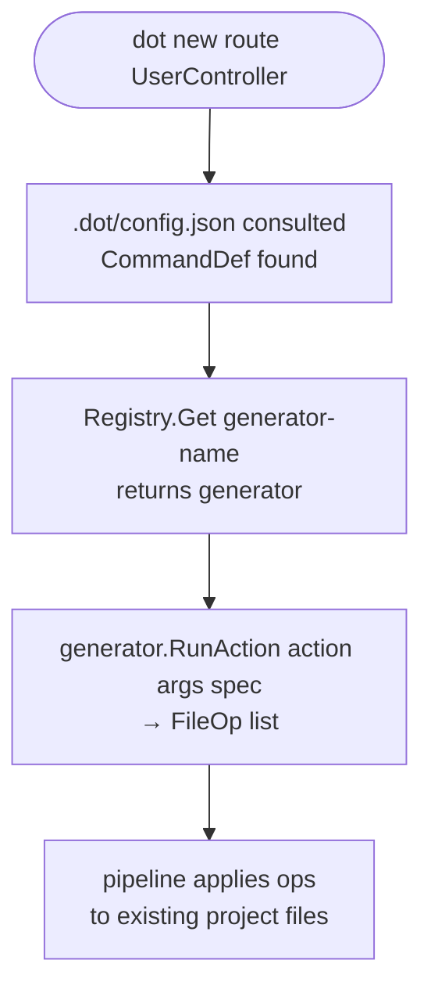

# Generator Specification

> **See also:** [Authoring guide](authoring-guide.md) — how to implement a generator step-by-step.

---

## What is a generator

A generator is a Go struct that implements the `Generator` interface
(`internal/generator/generator.go`). It knows about one specific combination of language
and module — for example `go` + `rest-api`, or `*` + `docker`. Given a `Spec` (the
structured description of the user's project), it produces a list of `FileOp`s:
instructions for which files to create, append to, or patch.

A generator does not perform I/O itself — the pipeline does. A generator produces
instructions (`FileOp`s) that the pipeline executes: create this file, append these lines,
patch this location in that file. The generator never opens a file descriptor.

Official generators are pure functions of their input: same `Spec`, same `FileOp`s, every
time. Custom and enterprise generators may call external services when the use case requires
it — see [limits](#what-a-generator-cannot-do) for the tradeoffs.

---

## What a generator can do

### File operations

- **Create files** — emit `Create` or `Template` FileOps to write new files from scratch.
  The generator fully owns the file content.
- **Append to files** — emit `Append` ops. Multiple generators can each contribute lines
  to the same file. This is the right op for shared files like `Makefile`,
  `docker-compose.yml`, or `.dot/prompts.md`.
- **Modify existing files** — emit `Patch` ops to inject code at a named anchor point
  inside a file that already exists on disk. This is how a Sentry generator edits
  `next.config.js` or wraps `_app.tsx` — the same mechanism a setup wizard uses, but
  expressed as a declarative `FileOp` instead of imperative scripting.

  Anchors today: `AnchorImportBlock`, `AnchorMainFunc`, `AnchorInitFunc` (Go-specific).
  New anchors for JS/TS patterns (`AnchorNextConfig`, `AnchorJSXRootWrapper`,
  `AnchorDefaultExport`) are the natural next additions — see [patch-strategies.md](patch-strategies.md)
  for how to add one.

   Example — a Sentry generator for Go:
   ```go
   // Create the Sentry config file
   {Kind: Create, Path: "sentry/config.go", Content: "..."},
   // Add the Sentry import to main.go
   {Kind: Patch, Path: "main.go", Anchor: AnchorImportBlock, Content: "github.com/getsentry/sentry-go"},
   // Initialize Sentry in main() function
   {Kind: Patch, Path: "main.go", Anchor: AnchorMainFunc, Content: "sentry.Init(...)"},
   ```

### Prompt scaffolding

A generator can append to `.dot/prompts.md` via an `Append` op. This file is the handoff
point between dot (structural scaffolding) and an LLM (business logic).

Example: a REST API generator appends a prompt describing the generated routes and handler
stubs so the user can paste it into an LLM and ask it to fill in the handler bodies.

```go
generator.FileOp{
     Kind:      generator.Append,
     Path:      ".dot/prompts.md",
     Generator: g.Name(),  // Generator: name of the generator that emitted this FileOp (used for logging, conflict detection, and audit trails)
     Content: `## Go REST API — generated by dot

The following routes were scaffolded by dot. Ask your LLM:
"Implement the handler bodies for these routes: ..."
`,
}
```

### Commands

A generator returns `CommandDef` entries from `Commands()`. These become `dot new <noun>`
subcommands, persisted to `.dot/config.json` after `dot init`. Example: `dot new route`,
`dot new handler`, `dot new migration`.

### Composition

A generator can call another generator's `Apply()` and merge the returned `[]FileOp` into
its own output. This is how architecture pattern generators (clean, hexagonal) plug into
REST API generators without duplicating folder structure logic.

### Branching on Spec

A generator can read any field from `spec.Spec` to vary its output: language, architecture,
modules, config, database, monorepo layout, and more. Same Spec → same FileOps, always.

### Language-agnostic generators

A generator can use `Language() = "*"` to match any project language. Use this for
cross-cutting concerns like GitHub Actions, Docker, or Makefile.

### Multiple modules

A generator can return multiple strings from `Modules()` to handle related modules under
one implementation. This is useful when two modules are tightly coupled and should always
be installed together. For example, a PostgreSQL + Prisma generator might return both
`["postgres", "prisma"]` — when the user selects either one, both get activated:

```go
func (g *PostgresPrismaGenerator) Modules() []string {
    return []string{"postgres", "prisma"}
}
```

---

## What a generator cannot do

**Cannot generate business logic.** dot is not an AI. Generators produce deterministic
structural scaffolding only. They do not infer domain intent, write handler bodies, or
produce code that requires understanding the user's specific problem. The `.dot/prompts.md`
file is the designed handoff point for that work.

**Cannot open file descriptors.** Generators return `[]FileOp`; the pipeline performs all
disk I/O. A generator must not call `os.WriteFile`, `os.Open`, or any filesystem function
directly — that is the pipeline's job. The right way to modify an existing file is to emit
a `Patch` or `Append` op targeting its path.

**Cannot read existing file content in `Apply()`.** `Apply()` receives only the `Spec`.
It has no knowledge of what files already exist on disk or what they contain. If a `Patch`
anchor is not found in the target file at write time, the pipeline returns an error — the
generator does not pre-check.

**Cannot be non-deterministic.** No `rand`, no `time.Now()`, no map iteration order in
output. The same `Spec` must always produce identical `[]FileOp`.

**Official generators must not perform side effects.** No network calls, no shell exec,
no DB access inside `Apply()` or `RunAction()`. Official generators are pure functions —
same Spec always produces the same FileOps, no external state involved.

**Custom and enterprise generators may perform side effects.** Custom and enterprise generators may perform side effects when the use case requires it:
fetching a schema from an internal API, calling a corporate template registry, running a
shell command to discover installed tooling. This is allowed — the interface does not
prevent it. The tradeoff is that such generators are no longer deterministic and cannot be
tested without the external dependency available.

**Cannot override another generator's `Create` at the same priority.** The pipeline aborts
before any writes when two generators claim the same file at the same priority. Use a
higher `Priority` value or switch to `Append`/`Patch`. Priority is a numeric value where
higher numbers take precedence — for example, `Priority: 100` overrides `Priority: 50` when
both generators try to create the same file. Official generators use priority 0 by default;
use higher values only when you intentionally want to override another generator's output.

**Cannot claim the same (Language, Module) pair as an existing generator.** `Register()`
rejects it at startup with a descriptive error.

**Cannot write to `.dot/config.json` or `.dot/manifest.json`.** These are pipeline-managed
files. Generators may write to other `.dot/` paths (e.g. `.dot/prompts.md`) via `Append`
ops.

---

## How a generator works

### The binding model

The `dot init` survey is two-phase. Phase 1 (base questions: name, type, language) selects
a **Registry**. Phase 2 runs that registry's own question tree immediately after Phase 1 completes; there is no return to Phase 1. Each question in the tree
maps to a field in `spec.Spec`. The user's answer fills that field and selects which
generator branch activates.

```
Phase 1 — base survey           Phase 2 — registry question tree
──────────────────────          ──────────────────────────────────────
"Language?" → "go"           →  GoRegistry selected
                                  "Modules?" → "redis"  → GoRedisGenerator
                                  "Modules?" → "docker" → DockerGenerator
                                  "Architecture?" → "clean" → GoCleanArchGenerator
```

**Questions define the interface. Registries are the implementations. Generators are the leaves.**

The question templates ("Architecture?", "Linter?", "Database?") are shared definitions.
A RustRegistry and a GoRegistry can both use the `ArchitectureQuestion` template — same
text, same options — but wire the answers to different generators. No duplication.

See [registry-design.md](../architecture/registry-design.md) for the full design.

### Init phase — `dot init`



### Post-init phase — `dot new`



### ASCII summary

```
dot init
─────────────────────────────────────────────────────
Phase 1: base survey (name, type, language)
    │
    ▼
Registry lookup by language
    │ GoRegistry / RustRegistry / TsRegistry / ...
    ▼
Phase 2: registry question tree
    │ modules, architecture, linter, db, ...
    ▼
spec.Spec assembled
    │
    ▼
generators activated by tree traversal
    │ []FileOp from each
    ▼
pipeline → files on disk
         → .dot/config.json (CommandDefs)
         → .dot/prompts.md  (if emitted)

dot new
─────────────────────────────────────────────────────
dot new route UserController
    │
    ▼
.dot/config.json → CommandDef → Registry.Get(generator)
    │
    ▼
generator.RunAction(action, args, spec) → []FileOp
    │
    ▼
pipeline → files patched in project
```
